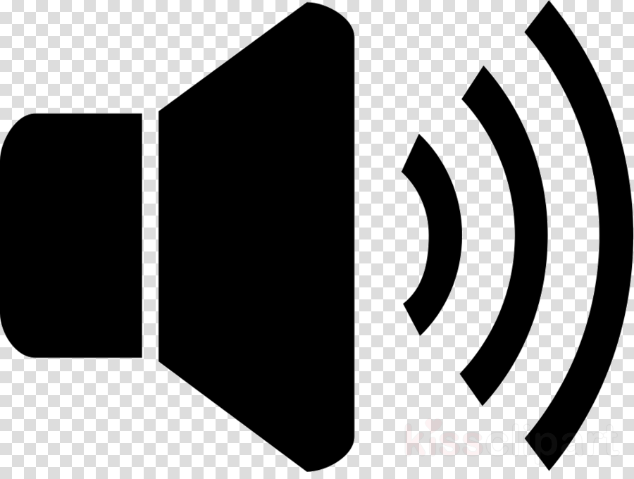

<p align="center">
  
</p>

<h1 align="center">🎵 Audio Cutter Pro</h1>

<p align="center">
  <strong>A professional-grade, browser-based audio editor built with Flask & WaveSurfer.js</strong><br>
  Cut, trim, fade, normalize, reverse & export audio — all from your browser. No signup required.
</p>

<p align="center">
  
  
  
  
</p>

---

## ✨ Features

| Feature | Description |
|---------|-------------|
| 🎯 **Multi-Region Cutting** | Create unlimited cut regions on the waveform — each independently adjustable |
| 🔊 **Audio Effects** | Fade In, Fade Out, Normalize (loudness leveling), Reverse |
| 📤 **Flexible Export** | Export as **MP3** (320kbps) or **WAV** — merged or as separate ZIP files |
| 🎙️ **Microphone Recording** | Record audio directly from your browser microphone |
| 🖱️ **Drag & Drop Upload** | Simply drag your audio/video file onto the page |
| ↩️ **Undo/Redo** | Full undo system (Ctrl+Z) for all region operations |
| ⌨️ **Keyboard Shortcuts** | Space (play), Delete (remove region), Ctrl+Z (undo), ← / → (seek) |
| 📱 **Fully Responsive** | Works beautifully on mobile, tablet, and desktop |
| 🎨 **Premium Design** | Swiss Design aesthetic — clean, professional, modern glassmorphism |

## 📁 Project Structure

```
Audio_Cutter/
├── app.py                  # Flask backend — routes & audio processing
├── logger.py               # PostgreSQL upload logger (optional)
├── requirements.txt        # Python dependencies
├── .env.example            # Environment configuration template
├── .gitignore              # Git ignore rules
│
├── static/
│   ├── style.css           # Complete CSS — design system + responsive
│   ├── script.js           # Frontend JS — WaveSurfer, regions, UX
│   └── logo.png            # App logo
│
├── templates/
│   └── index.html          # Main HTML template (Jinja2)
│
├── uploads/                # Temporary uploaded files (auto-cleaned)
├── processed/              # Temporary processed files
├── logs/                   # Application logs
│
├── docs/
│   ├── SETUP.md            # Detailed setup guide (layman-friendly)
│   ├── PRODUCTION.md       # Production deployment guide
│   ├── USER_MANUAL.md      # End-user documentation
│   └── CONTRIBUTING.md     # Contribution guidelines
│
└── README.md               # ← You are here
```

## 🚀 Quick Start (5 minutes)

### Prerequisites

- **Python 3.9+** → [Download Python](https://www.python.org/downloads/)
- **FFmpeg** → [Download FFmpeg](https://ffmpeg.org/download.html) (required for audio processing)

### Installation

```bash
# 1. Clone the repository
git clone https://github.com/ArPaN-DS/Audio_Cutter.git
cd Audio_Cutter

# 2. Create a virtual environment
python -m venv venv

# 3. Activate it
# Windows:
venv\Scripts\activate
# macOS / Linux:
source venv/bin/activate

# 4. Install dependencies
pip install -r requirements.txt

# 5. Run the app
python app.py
```

### 🎉 Open your browser → [http://localhost:5000](http://localhost:5000)

> 📖 **Need more help?** See the [detailed setup guide →](docs/SETUP.md)

## 🛠️ Tech Stack

| Layer | Technology |
|-------|-----------|
| **Backend** | Python 3.9+, Flask 3.x |
| **Audio Engine** | Pydub + FFmpeg |
| **Frontend** | HTML5, CSS3, Vanilla JavaScript |
| **Waveform** | WaveSurfer.js v7 (Regions + Timeline plugins) |
| **Fonts** | Google Fonts — Inter |
| **Icons** | Font Awesome 6 |
| **Logging** | PostgreSQL via psycopg2 (optional) |

## ⌨️ Keyboard Shortcuts

| Shortcut | Action |
|----------|--------|
| `Space` | Play / Pause |
| `Double-Click` | Add new region on waveform |
| `Click Region` | Select a region |
| `Delete` | Remove selected region |
| `Ctrl + Z` | Undo last action |
| `← / →` | Skip back / forward 5 seconds |
| `M` | Mute / Unmute |
| `?` | Show shortcuts panel |

## 📚 Documentation

| Document | Description |
|----------|-------------|
| [📋 Setup Guide](docs/SETUP.md) | Step-by-step setup for beginners |
| [🏭 Production Guide](docs/PRODUCTION.md) | Deploy to a real server |
| [📖 User Manual](docs/USER_MANUAL.md) | How to use every feature |
| [🤝 Contributing](docs/CONTRIBUTING.md) | How to contribute to this project |

## 🔧 Configuration

Copy `.env.example` to `.env` and update the values:

```bash
cp .env.example .env
```

| Variable | Default | Description |
|----------|---------|-------------|
| `FLASK_SECRET_KEY` | `audio_cutter_master_key` | Session secret key |
| `FLASK_PORT` | `5000` | Server port |
| `DB_PASSWORD` | — | PostgreSQL password (optional) |

## 📄 License

This project is licensed under the MIT License — see the [LICENSE](LICENSE) file for details.

---

<p align="center">
  Made with ❤️ by <strong>ArPaN-DS</strong>
</p>
